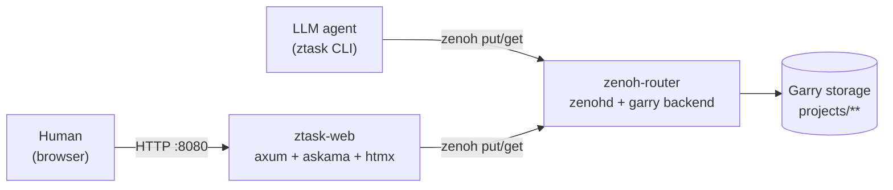
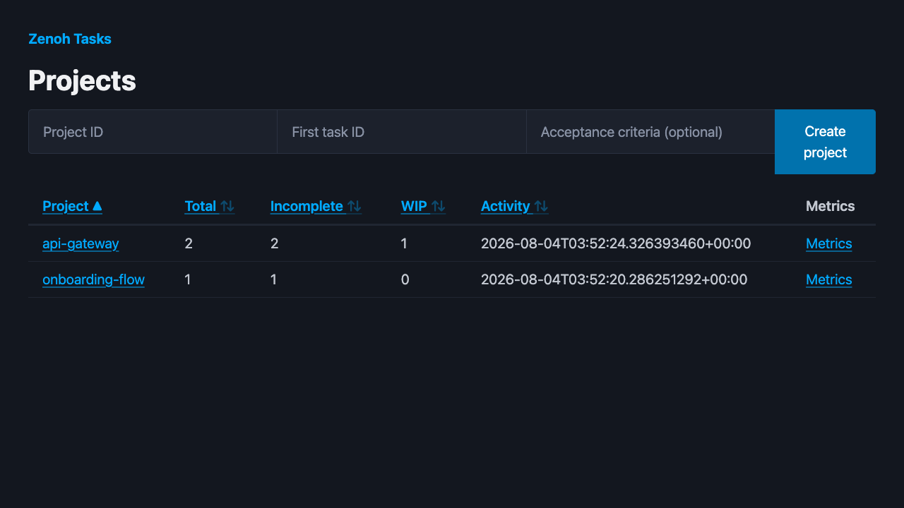
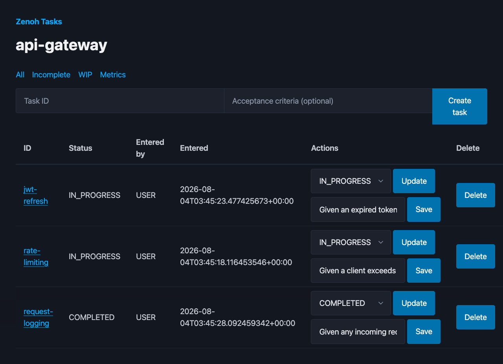
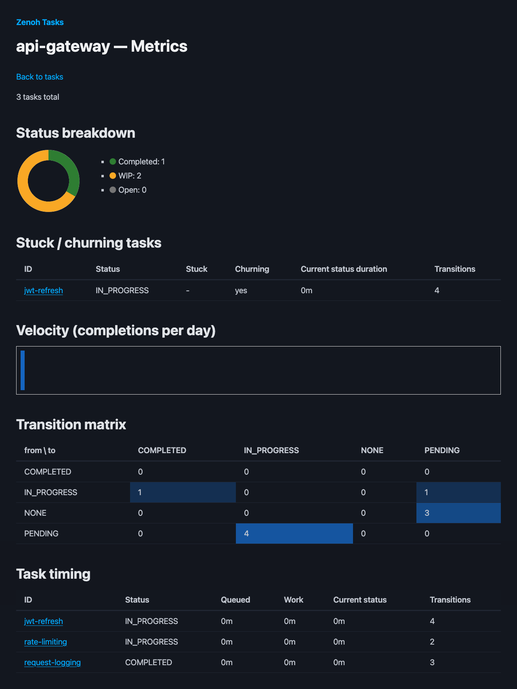

# Zenoh Task Tracker

A task tracker for LLM agents and developers, backed by a [Zenoh](https://zenoh.io/)
keyspace with durable storage. Tasks live as hierarchical key-values under
`projects/<project_id>/tasks/<task_id>/...`, persisted by a `zenohd` router
running the [Garry](https://github.com/Argylelabcoat/Garry) embedded KV
storage backend.

Three pieces:

- **`ztask`** — a Python CLI for LLM agents and developers to create, query,
  and update tasks. Defaults task creation to `entered_by: LLM`.
- **`ztask-web`** — a Rust (axum + htmx) admin web UI for humans: a sortable
  all-projects dashboard with inline project creation, a per-project
  dashboard with inline create/update-status/edit-criteria/delete, and a
  per-project metrics dashboard (status breakdown, stuck/churning task
  detection, completion velocity, a status transition heatmap, and per-task
  timing). Defaults task creation to `entered_by: USER`.
- **router** — a `zenohd` + Garry container that both talk to.

## Quick start

Requires a container runtime (`docker`, or `container` on macOS —
`scripts/up.sh` uses `docker` by default; set `ZTASK_CONTAINER_RUNTIME` to
override).

```bash
./scripts/up.sh
```

Brings up the router (`localhost:7447`) and the web UI
(`http://localhost:8080`) on a shared `ztask-net` network.

For the CLI, install and point it at the router:

```bash
poetry install
export ZTASK_ZENOH_ENDPOINT=tcp/localhost:7447
poetry run ztask create --project demo task-1 --criteria "Given X, When Y, Then Z"
poetry run ztask list --project demo
```

Agent containers joined to `ztask-net` use `tcp/zenoh-router:7447` instead.

## Agent Skills

Pre-built skills for LLM agents to autonomously execute tasks. Located in `.agents/skills/` — compatible with MiMoCode, Claude Code, and other skill-aware agents.

### Installation

**MiMoCode** — skills are auto-discovered from `.agents/skills/`. No install needed.

**Claude Code** — symlink or copy into `.claude/skills/`:
```bash
ln -sf ../../.agents/skills .claude/skills
```

**Other agents** — point your agent at the skill files in `.agents/skills/*/SKILL.md`.

### Skills

| Skill | Command | Purpose |
|-------|---------|---------|
| `ztask-orchestrator` | `/ztask-orchestrator <project-id>` | Fetch all incomplete tasks, spawn a sub-agent per task, drive to completion |
| `ztask-worker` | (embedded in sub-agent prompts) | Single-task lifecycle: claim → execute (TDD) → finalize |
| `ztask-status` | `/ztask-status <project-id>` | Project dashboard — task counts, stalled flags, overview |

### Usage

```bash
# 1. Start the router
./scripts/up.sh

# 2. Create tasks
ztask create auth-login --project myapp --criteria "Given a user with valid creds, when they POST /login, then return a JWT"
ztask create auth-refresh --project myapp --criteria "Given an expired token, when they POST /refresh, then return a new JWT"

# 3. Run the orchestrator from your LLM agent
#    MiMoCode:  /ztask-orchestrator myapp
#    Claude:    /ztask-orchestrator myapp
```

The orchestrator will:
1. List all incomplete tasks
2. Spawn a sub-agent for each task
3. Each sub-agent claims, executes (TDD), and finalizes its task
4. Orchestrator collects results and reports summary

### How it works

```
┌─────────────────────────────────────────────────────────┐
│  Orchestrator (coordinator)                             │
│    ztask list --filter incomplete                       │
│    ├─► Sub-Agent A: task "auth-login"                   │
│    │     ztask update-status IN_PROGRESS                │
│    │     write tests → implement → pass tests           │
│    │     ztask update-status COMPLETED                  │
│    ├─► Sub-Agent B: task "auth-refresh"                 │
│    │     ztask update-status IN_PROGRESS                │
│    │     write tests → implement → pass tests           │
│    │     ztask update-status COMPLETED                  │
│    └─► collect results, report summary                  │
└─────────────────────────────────────────────────────────┘
```

## `ztask` CLI

```
ztask list --project <id> [--filter all|incomplete|wip]
ztask get <task-id> --project <id>
ztask create <task-id> --project <id> [--criteria "..."] [--entered-by llm|user]
ztask update-status <task-id> <status> --project <id> [--note "..."]
```

Every status change and task creation appends an entry to the task's
history log. See `docs/superpowers/specs/2026-07-31-zenoh-task-tracker-design.md`
for the full design.

## Architecture



Both `ztask` (Python CLI) and `ztask-web` (Rust admin UI) talk to the same
`zenohd` router over the zenoh wire protocol; the router persists everything
through the Garry storage plugin. Neither client talks to the other — the
keyspace is the shared contract.

## Screenshots

**All-projects dashboard** — inline project creation, sortable columns (name/total/incomplete/wip/activity), and a direct link to each project's metrics dashboard:



**Per-project view** — Delete is its own column, separate from Update/Save:



**Per-project metrics dashboard** — status breakdown, stuck/churning detection, completion velocity, a status transition heatmap, and per-task timing:



## Web UI

Source at `web/` (crate `ztask-web`). Talks to the router directly over the
official zenoh Rust SDK — no CLI shell-out. See
`docs/superpowers/specs/2026-08-01-web-ui-design.md` for the design and
`docs/superpowers/plans/2026-08-01-web-ui-implementation.md` for the
implementation plan.

Run it locally against an already-running router:

```bash
cd web
ZTASK_ZENOH_ENDPOINT=tcp/localhost:7447 cargo run
```

## Development

```bash
# Python (CLI)
poetry install
poetry run pytest                    # unit tests
poetry run pytest -m integration     # + real router container (slow)

# Rust (web UI)
cd web
cargo test                                                # unit tests
cargo test --test web_integration -- --ignored --test-threads=1  # + real router container (slow)
```

## Layout

```
ztask/            Python CLI package
web/               Rust web UI crate (axum + askama + htmx)
docker/router/     zenohd + Garry router image
docker/web/        web UI image
scripts/up.sh      brings up router + web UI on a shared network
tests/             CLI unit + integration tests
docs/superpowers/  design specs and implementation plans
.agents/skills/    LLM agent skills (orchestrator, worker, status)
```
